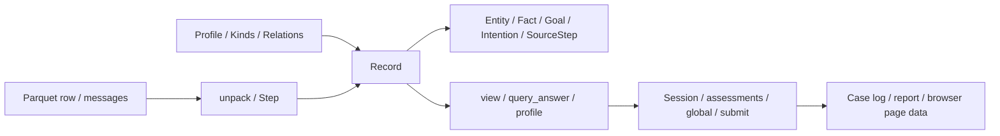

# 项目自定义数据结构速查

核对日期：2026-10-01。本文使用仓库根目录下的相对路径引用源码。

覆盖项目运行源码的自定义类、类型别名、领域解析结果、操作输出、查询视图、判断协议、会话文件、四阶段模型结果、实验日志、评分报告和前端数据。第三方库的内部对象、测试夹具、生成页面和临时脚本配置不作为业务数据模型；接口类与异常类单独标明。第 8 节按类型名提供完整字段、默认值与方法索引；第 9–10 节补充源码中各字典构建点及条件追加字段，便于查找嵌套结构。

## 1. 快速导航与数据流

- 实体/类型/关系：`Entity`、`Kinds`、`Relation`、`Relations`。
- 任务/意图：`Constraint`、`Goal`、`IntentionParameter`、`IntentionOption`、`Intention`。
- 轨迹/事实：`Step`、`SourceStep`、`Fact`、`Record`。
- 检查/导航/会话：`Verdict`、`Move`、`Call`、`Session`、`Lens`。
- 领域接口：`Profile`；领域规则见 `core/profiles/alfworld.py` 与 `webshop.py`。
- 实验状态：`Case`、`Model`、`BudgetExceeded`，以及 case log、manifest、API usage、submission、score report。
- 工作台：`WorkbenchData`、`MissingLookup`、`Handler`；浏览器 page data 与 run analysis。
- 查询字典：`profile`、`failed`、`contrast`、`entity-evidence/v4`、`trajectory-scan/v1`、`process-notes/v1`、`local-module-audits/v2`、`query-answer/v2`、`debug-packet/v3`、候选及候选族。
- 判断字典：`local-judgement/v2`、`global-review/v2`、protocol、submit；四阶段 MAP / REVIEW / TRACE / REVISE JSON。



查询方法：在文档搜索类名、schema、字段名或构建函数名。源码位置使用仓库相对路径加行号；行号对应本次扫描版本。

## 2. 核心类型语义与约束

### Entity、Kinds

`Entity(kind: str, index: str)` 是不可变实体标识，字符串形式为 `kind:index`，例如 `portable:cup_1`、`req:cup_in_sidetable`、`int:i3`。自身不验证 kind 是否已注册；通过 `Record.ent()` 建立实体时验证类型，并按字符串 ID 去重。`Kinds._parent` 是 `dict[str, str | None]`，表达单父类型继承。`declare()` 要求父类型先声明；同名同父声明允许，同名异父拒绝；`le(a,b)` 检查 a 是否属于 b 或其子类型。来源：`core/record.py:25`、`core/kinds.py:13`。

### Relation、Relations

`Relation` 是不可变关系定义，字段为 `name`、`arity`、`props`、`key`、`arg_kinds`、`value_types`。arity 只数实体参数，不包含 Fact.value。key 是参数位置元组，从 0 开始；`version_positions()` 返回非键位置，供检查器判断变化保存在实体参数中还是 Fact.value 中。例：`at(agent,place)` 的 key=(0,)，位置是 version；`open(place)` 全参数为键，状态在 value 中。

`Relations._r` 为 `dict[str, Relation]`。`declare()` 校验属性名、key 范围、arg_kinds 数量、重复关系名；默认 key 为全部位置，arg_kinds 为空表示不限制参数类型，value_types 默认为 any。`Record.add()` 根据关系定义校验参数数量、实体子类型和 value_type，保留通过结构校验的事实；功能冲突由后续检查检测。来源：`core/relations.py:23`、`:49`。

关系属性：functional（同键的结果唯一）、mutable（允许时间变化）、observed（对运行所见记录采用完整性假设）、symmetric、transitive。前三级已被检查逻辑使用；后两级目前支持声明，未自动执行对称或传递闭包。

### Constraint、Goal

`Constraint` 的 property 是 Entity，operator 是比较算子，expected 是期望值；value_type 与 unit 说明值的类型与单位，mode 说明验证依靠 selection、observation 或 semantic；span 保留任务原文，confidence 在 0..1。构造时校验算子、类型、mode 与置信度；大小比较只接受 number/money，semantic_match 只接受 text/string。来源：`core/record.py:46`。

`Goal` 用 count、of_kind、rel、target 描述数量化关系需求；attrs 是保留的旧属性表达，constraints 是实际可承载 Constraint 的约束元组（声明类型为 Tuple[Any,...]）；name 为可读名称。status_mode 只能为 tracked 或 unmodeled。`entity()` 返回 `req:<name>`，无 name 则用 `<rel>_<of_kind>`。tracked 参与 failed() 的确定性满足统计；unmodeled 仍是任务需求，但不被当作确定性可满足目标。来源：`core/record.py:187`。

### IntentionParameter、IntentionOption、Intention

`IntentionParameter` 记录计划参数的 name、value、value_type、span。`IntentionOption` 记录 verb、objects、role、span、preconditions、expected_effects，表示同一意图的可选实现。来源：`core/record.py:81`、`:90`。

`Intention` 保留 verb、objects、purpose、计划原文，以及 parameters、execution_options、serves、mentions、preconditions、expected_effects、commitment、extraction、confidence。serves 是服务目标，mentions 是显式提及目标，二者不能互换；purpose 是结构父节点，不直接证明因果联系。构造时校验 commitment 和置信度。

binding 是计算属性，不是构造字段：verb 与对象明确时为 full；verb 存在且 objects=None 为 verb_only；verb 未知但原文/对象表明存在意图时为 unbound；verb 未知、objects 为空且 span 为空时为 absent。objects=None 表示未指定对象，objects=() 可表示明确没有对象。来源：`core/record.py:101`。

### Step、SourceStep、Fact

`Step(t, env_text, agent_text, admissible, parts)` 是编译输入，parts 使用 memory/reflection/plan/action 四个完整模块名，值为文本或 None。`SourceStep(observation, agent, modules, admissible)` 保留原始证据；modules 同样使用完整模块名，admissible 为元组。来源：`core/compile_run.py:26`、`core/record.py:147`。

`Fact` 字段为 fid、rel、args、value、slot、side、t、situation、basis、purpose、span、value_type。fid 是 R.F 内从 0 开始的事实编号；t=0 可表示任务初始定义。situation 指向情境事实 ID；basis 是依赖事实 ID；purpose 指向需求或意图 Entity；span 保留原文。`Fact.key()` 返回 (rel,完整 args)，与 Relation.key 的参数位置定义不同。来源：`core/record.py:161`。

构建约束由 Record.add() 实施：slot/side 合法、关系已声明、实体参数与值类型合法；basis 与 situation 指向已存在且步骤不晚于当前事实的对象。同一步依据允许，任意未来步骤依据拒绝。构造 Fact 本身没有执行这些检查。

### Record

`Record` 聚合 `E: dict[str,Entity]`、`F: list[Fact]`、`goals: list[Goal]`、Kinds、Relations、intentions、source_steps、process_notes，并提供按实体、步骤、关系、完整参数链的索引。实例初始字段与方法见第 8 节。`length()` 取事实最大步骤，不直接取 SourceStep 数量。来源：`core/record.py:222`。

编译器还动态设置 domain、domain_briefing、commit_values；查询时可能设置 `_entity_view_intention_cache`、`_entity_view_requirement_cache`、`_intention_validation_cache` 等缓存。以 `setattr` 或外部 `R.<field>=...` 添加的属性不一定出现在类构造器字段列表。

### Verdict、Move、Call、Session

`Verdict(value, reason, cites=(), operands=())` 是三值检查结果；value 使用 sat/viol/unk，cites 是事实 ID，operands 是需要进一步检查的窄范围文本。`__bool__()` 总是抛异常，调用者必须明确比较 value；该枚举约定没有在 dataclass 构造器中自动验证。来源：`core/criterion.py:24`。

`Move(focus:list[int], passed:list[int], note='')` 是 back/up/down/versions/neighbours/siblings 的内存返回值。`dbg.py` 只特殊序列化 Verdict，对 Move 使用 json.dumps(default=str)，因此 CLI 可能得到描述 Move 的 JSON 字符串，而非 focus/passed/note 对象。来源：`core/operators.py:22`、`core/dbg.py:138`。

`Call(op,args,n_out,model_call)` 记录会话调用。n_out 是输出对象 len() 或 1，不能统一理解为事实行数；model_call 是会话层计数标记（check 返回 UNK 时为真），不是四阶段实际 API 请求数。`Session` 维护 Record、budget、calls、compared、frontier、notes、assessments 和覆盖状态。compared 是候选 ID 对的 frozenset 集合，frontier 是 held ID 列表；assessments 形如 step → module → judgement。来源：`core/session.py:25`、`:32`。

### Profile、Lens、实验与工作台类型

`Profile` 是 typing.Protocol，约定 kinds、relations、parse_goal、parse_observation、parse_memory、parse_intention、parse_action、decompose、null_verb、bears_on、situating_relation。实际领域模块还提供 domain_briefing、commits，部分提供 evaluate_discharges；实际 parse_intention 接口可能额外接收 goals。它与 `operators.profile()` 返回的概况字典是不同对象。来源：`core/profiles/base.py:18`。

`Lens = Callable[[Record, list[Fact]], list[Fact]]`，即可组合的事实检索函数，用于 about/why/purpose/window。来源：`core/primitives.py:14`。

`Case` 管理单 case 路径、命令日志、模型结果和提交；`Model` 管理 SDK client、provider/name、预算、用量文件、partial 文件和 spent；`BudgetExceeded` 是费用不足异常。`WorkbenchData` 保存受支持领域的原始行索引，record() 用 LRU 缓存构建的 Record；`MissingLookup` 是查找异常，嵌套 Handler 是标准库 HTTP handler 子类。完整实例属性见第 8 节。

## 3. 领域解析与基础操作字典

### 原始数据行与消息

代码消费的数据行包含 trajectory_id、task_type、full_trajectory，评分/展示还读取 critical_failure_step、critical_failure_module、failure_types、failure_reasonings、step_annotations、llm_model 等字段。load() 追加 `_split`。这些是数据集输入字段，非 Python 自定义 dataclass；可选列取决于数据集版本。full_trajectory 是 JSON 字符串，内部 messages 为包含 role/content 的消息列表。unpack() 返回 `(tid, task, env:list[str], agent:list[str], admissible:list[list[str]])`。来源：`core/data_io.py:18`、`:38`，前端读取位置见第 9 节。

### ParserFact、ParserAction、ParserIntention

- ParserFact：`{rel:str, args:list[tuple[kind,index]], value:Any, span:str, value_type?:str}`，由 parse_observation/parse_memory 返回，随后编译为 Fact。
- ParserAction：在上式基础上有 `admissibility`，可有 `discharges:{rel,value,...}`，也可能返回 None。合法性标签见第 7 节。
- ParserIntention：`{rel?:str, args?:list[tuple[kind,index]]|None, parameters?:list[dict], execution_options?:list[dict], serves?:list[Entity], mentions?:list[Entity], preconditions?:list[str], expected_effects?:list[str], commitment?:str, extraction?:str, confidence?:float}`，也可能返回 None。编译器将 parameters/options 转换为对应 dataclass。
- evaluate_discharges 的结果是满足检查声明列表，可包含 rel、args、value、basis、purpose、span、value_type。
- DomainBriefing：`{name, task_shape, entity_rules:list[str], evidence_rules:list[str], critical_questions:list[str]}`，由领域模块提供。

以上字典是内部约定，没有统一 TypedDict 定义；各领域分支字段见第 9 节源码索引。

### profile

完整字段：`ir_version, domain, domain_briefing, trajectory, task, steps, facts, by_slot, by_side, relations_touched, goals, tracked_goals, unmodeled_goals, unsatisfied, functional_conflicts, facts_without_basis, intentions, purpose_depth, ending, timeline`。

- by_slot/by_side 为 `dict[str,int]`；relations_touched 和需求名称字段为字符串列表。
- unsatisfied 是 FailedRequirement 列表；ending 为 `{kind:'committed'|'cut_off', at:int}`。
- timeline 为 `{step:int, did:str|None, taken:str|None, said:list[str]}` 列表。taken 是 admissibility 值，不能直接解释为动作成功。
- facts 是编译事实数，by_slot 统计事实而非模块文本出现次数；steps 是最大事实步骤。

来源：`core/operators.py:343`、`:376`、`:392`。

### failed、could_have、conflicts、contrast、其他操作

- FailedRequirement：`{requirement:str, needs:int, met:int, expression:str}`；failed 只检查 tracked 需求，统计相应检查事实。`core/operators.py:303`。
- Opportunity：`{step:int, decided:bool, met:bool|None, took:str|None}`；could_have 返回该列表。`:319`。
- FunctionalConflict：`{relation:str, key:list[str], at_step:int|None, survivors:list[str]}`；conflicts 返回列表。`:171`。
- ContrastResult：`{rows:list[ContrastRow], discriminates:list[str], tells_you_nothing:list[str]}`。行字段为 fid、step、slot、states、verdict、because、requirements_live_here、reaches、put_right_after、after_commit。只呈现差异，不自动选择根因。`:121`。
- CheckResult：CLI 将 Verdict 转成 `{verdict, reason, cites:list[int], operands:list[str]}`。`core/dbg.py:138`。
- CountResult：`{n, of, steps:list[int], fids:list[int]}`；state 为动态的关系字符串 → 值字典；span 返回字符串；about/lens/attempts 返回事实 ID 列表。
- Note：`{note:str, fid:int, cites:list[int]}`；Recall/Transcript 行为 `{op, args:list[str], n_out, model_call}`。
- Cost：`{operator_calls, model_calls, budget, facts_in_record}`，无预算时 budget=-1。
- CLIError：`{error:str}`；Case 层解析失败时可产生 `{unparsed_stdout, stderr}`；strict=False 时外包 `{exit_code:int, output:Any}`。

## 4. 查询视图与嵌套证据结构

### 统一 FactView 与 ConstraintView

FactView（`core/views.py:45`）：`{fid, step, slot, side, relation, arguments:list[str], value, value_type, basis:list[int], purpose:str|None, span}`。with_support=True 且 mind 来源时追加 `support:{verdict,reason,cites,operands}`。它用 relation/arguments/step 表示 Fact 的 rel/args/t；不会完整照搬 Fact 的所有字段。

ConstraintView（`:70`）：`{property:str, attribute:str, operator, expected, value_type, unit, mode, source_span, confidence}`。SourceStep 和 Intention 进入 JSON 时也会将 Entity 转字符串、元组转列表；不要把 JSON 字段与内存类型混为一谈。

### entity-evidence/v4

schema 来自 `core/views.py:32`。`entity:req:<name>` 返回需求视图：`{schema, entity:{id,kind}, definition, status, evidence, value_changes, intentions, gaps}`。

- definition：count、relation、target、constraints、status_mode。
- status：state、recorded_met、required_count、reason、qualifying_steps、fully_qualifying_steps、decision_steps、limitations。
- evidence/value_changes/intentions/gaps：不同证据与缺口行列表，其字段见 `_requirement_view` 等构建函数索引。

意图实体返回 `{schema,entity:{id,kind:'intention'},definition,evidence,execution}`，definition 是意图行的 intention 部分，execution 是完整 IntentionRow。通用实体返回 `{schema,entity,relations,evidence,intentions}`；产品实体额外有 assignments 和 page_visits。relations 使用关系名作为动态键，值为 FactView 列表；assignments 使用属性名作为动态键，值为 `{fid,step,value,payload}` 列表。

requirements 聚合为 `{schema,task_contract,requirements}`。task_contract 含 verbatim、structured_requirement_count、tracked_requirement_count、unmodeled_requirement_count、coverage、limitation；coverage 固定为 `not_proven_exhaustive`。requirements 行含 entity、definition、status、gaps、evidence_counts（events/changes/intentions 的数量）。查询 section/detail 会改变投影。

### IntentionRow 与 IntentionValidation

`_intention_row` 把 Intention、计划/动作、合法性与约束提及整合。row 使用 step、intention、plan、action、admissibility、constraint_mentions、validation、absence_note。intention 子对象含 entity、binding、verb、objects、recorded_parent、parent_note、parameters、execution_options、serves、mentions、preconditions、expected_effects、commitment、extraction、confidence；对齐检查在 validation.plan_action_alignment 中。

`validate_intention`（`core/intention_validation.py:246`）无意图时返回 `{entity,status:'absent'}`；否则 `{entity,status:'parsed',plan_action_alignment,constraint_bindings,realized_option,preconditions,expected_effects}`。constraint binding 行包含 requirement、status_mode、constraints、relation、explicit_in_plan、explicit_in_action、recorded_met_before_or_at_step、evidence_fids。前置条件与效果判断有各自状态和证据，不能当作全局根因结论。

### episodes、trajectory-scan/v1、changes、assignments

episodes 返回 `{schema:'entity-evidence/v4',episodes:list[Episode]}`。Episode 基于时间窗口组织 step、signals、task_links、before、at、after：before 包含此前状态、目标和动作/预算历史；at 包含四模块输出、intention、合法性、对齐与前置条件；after 包含后续观察与预期效果。完整嵌套行见 `_episodes_view` 的字典索引。

scan 返回 `{schema:'trajectory-scan/v1',contract,requirements,episodes}`。requirements 行是 `{requirement,constraints,terminal_state,status_reason}`；episode 是适合按时间阅读的 memory/reflection/plan/action 与 outcome 结构。detail:summary 会截短文本并删除部分 support，不保证与 full 的形状完全相同。

changes/assignments 返回关系赋值历史；changes 顶层为 `{schema,changes:list[dict]}`。每行可包含 step、fid、relation、key、version、value、side、slot、span 等，具体变化分支见 `_all_changes`。

### process-notes/v1

Record.process_notes 是 `dict[int,ProcessNote]`。每个 ProcessNote 含 schema、step、note、observation、agent_modules、action_outcome、requirements、requirement_transitions、flags、entities、assignments、evidence_fids、boundary。来源：`core/process_notes.py:86`。

- observation：`{text,fids}`；agent_modules 以 mem/refl/plan/act 为动态键，对应 `{fid,text}` 列表。
- action_outcome：`{action_fids,admissibility,admissibility_fids,next_response_text,next_observation_fids,no_effect}`。
- RequirementState：`{requirement,state,reason,evidence_fids,decision_fids}`；Transition：`{requirement,from,to}`。
- Flag：`{kind,requirement,reason,evidence_fids}`；Entities：`{touched,introduced}`。
- BoundedEvidence：`{items:list,count:int,truncated:bool}`；summary 投影将一些列表替换为该对象，例如 evidence、action_fids、next_observation_fids。

view process_notes 顶层包含 schema 与 notes，并经通用查询处理追加 query_answer/覆盖信息。过程摘要描述已记录的进展，不负责模块错误归属。

### local-module-audits/v2 与 ReviewPacket

local_audits 顶层：`{schema,task_contract,domain_briefing,local_review_contract,coverage,audits}`。coverage 含 steps、step_count、modules_per_step 与覆盖说明；筛选后还会补充 returned_steps 等信息。来源：`core/views.py:1438`。

Audit 行：`{step,step_summary,transition,recent_history,shared_context,modules,next_outcome,routing_signals}`。shared_context 包含 current_observation、task_state、available_targets、prior_action_history、prior_budget_history、intention、preconditions。modules 以 memory/reflection/plan/action 为键。

每个 ModuleAudit：`{outputs,input_refs,review_context,derived_checks,retrieval_hints,judgement}`；judgement 初始是 not_computed。derived_checks 包含 contract_coverage、claims、exploration_coverage、validation。review_context 即 ReviewPacket，含 question、input_context、output_text、output_fids、next_feedback、evidence_scope、boundary。input_context 因模块不同保留不同上游文本；full 和 summary 会做不同投影。来源：`core/local_context.py`。

### query-answer/v2

每次 view 的程序化返回是 `{query_answer:QueryAnswer, **ViewData}`。QueryAnswer 含 schema、query、focus、answer、constraint_progress、relations、direct_evidence、step_progress、related_queries、coverage、boundary。来源：`core/query_answer.py:313`、`core/views.py:2021`。

direct_evidence 行为 `{fid,step,source,relation,arguments,value,text,meaning}`。coverage 记录 returned_fid_count、candidate_evidence_count、direct_evidence_count、direct_evidence_truncated、returned_steps、progress_steps、related_entity_count、related_entities_truncated。focus 可以为空；答案是查询证据说明，不是根因裁决。

### repair-candidates/v1、candidate-families/v1、debug-packet/v3

candidates 顶层 `{schema:'repair-candidates/v1',candidates}`；单候选为 `{candidate_id,fid,step,module,trigger,proposition,evidence_for,evidence_against,direct_consumers,local_repair,features,ranking_status}`，candidate_id 形如 `cand:{fid}:{trigger}`，ranking_status 为 `unranked`。候选由检索规则产生，与 local-judgement 的 error 不等价。candidate_families 顶层含 schema、families、warning；族行含 family_id、module、trigger、occurrence_steps、occurrence_fids、first_step、last_step、evidence_for、evidence_against、direct_consumers、local_repair、ranking_status、selection_warning。

packet 顶层字段：schema、trajectory、contract、requirements、feasibility、linear_scan、candidate_family_count、candidate_families_query、candidate_detail_count、candidate_details_query、complete_local_audits_query、exact_local_audit_query、supported_reasoning_routes、ranking_contract。它直接提供完整时间扫描和候选查询入口，未直接注入候选详情。来源：`core/views.py:1543`。

### QueryProgram

`_parse_program(spec)` 返回 `(source:str, options:dict)`。source 为 entity:<kind>:<index> 或 requirements/scan/local_audits/process_notes/intentions/episodes/changes/assignments/candidates/candidate_families/packet。steps 为 `(lo:int,hi:int)`，limit 为 int，detail 为 summary/full，state 为 satisfied/unmet/unresolved；section、event、support、slot、qualification、signal、commitment、binding、alignment、precondition、effect、constraint_relation、relation、side 等为字符串列表；entity/purpose/constraint/mention 是字符串。未知参数拒绝。来源：`core/views.py:1600`。

## 5. 评估、全局审查与会话文件

### local-judgement/v2

提交 assess 的输入：`{memory:Judgement,reflection:Judgement,plan:Judgement,action:Judgement}`，必须恰好四个模块。每个标准化 Judgement 为：

```python
{
    'schema': 'local-judgement/v2',
    'status': 'correct | error | uncertain | not_applicable',
    'fault_class': str | None,
    'primary_fid': int | None,
    'proposition': str,
    'evidence_for': list[int],
    'evidence_against': list[int],
    'immediate_effect': str,
    'requirement_links': list[str],
    'uncertainty': str,
    'reasoning': str,
    'instance_key': str,
}
```

这段是类型形状示意。instance_key 由模块、排序需求链接和规范化命题构造。error 必须有合法 primary_fid/fault_class、命题、直接影响和 reasoning，evidence_for 包含 primary_fid；uncertain 必须有命题与 reasoning，primary_fid 可为空。correct/not_applicable 不能携带主错误事实或故障类别；not_applicable 只用于无模块输出。证据 ID 必须存在且不晚于该步加 1；requirement_links 可以为空，但已有 ID 必须已知。来源：`core/local_judgement.py:54`。

assess 成功输出 `{step,assessments,coverage}`；Session.assessments 在内存用 int 步骤键，保存到 JSON 时键变成字符串。

### protocol 与 global-review/v2

Protocol：`{coverage,global_review_after_local,full_audit_steps_after_global,held_candidates}`。coverage 为 `{audit_read_steps,assessed_steps,missing_assessment_steps,local_complete}`。来源：`core/session.py:130`。

GlobalReview：`{schema:'global-review/v2',local_error_ledger,local_instances,local_status_counts,packet,selection_protocol,protocol}`。ledger 行是 `{step,module,**Judgement}`，包含 error/uncertain；status_counts 为状态→数量字典。

LocalInstance：`{instance_id,origin_step,last_step,module,proposition,requirement_links,occurrences,fix_status,chain_membership,terminal_connection,wasted_steps,state_status,clustering_status}`。occurrences 是 `{step,module,primary_fid}` 列表。自动分组依据规范化键；fix_status/chain_membership/terminal_connection 初始为 None，state_status 为 not_computed，不表示因果链已经算好。来源：`core/local_judgement.py:151`。

### SubmitResult 与 SessionFile

提交成功：`{accepted:true,step,fid,module,fault_class,operator_calls,model_calls}`；失败：`{accepted:false,refused_because:list[str]}`。修复文本用于校验和 concluded 事实，成功返回不包含完整 repair。

`core/sessions/<tid>.json` 保存 compared、frontier、notes、local_audit_steps、assessments、assessment_schema、global_review_after_local、full_audit_steps_after_global、n_calls、n_model_calls、submitted。compared 的 frozenset 在文件中转成排序列表；assessments 的步骤键转字符串，加载时恢复整数。来源：`core/dbg.py:48`、`:77`。

## 6. 四阶段、实验日志与浏览器结构

### 四阶段模型结果

- MAP：terminal_gaps、last_recoverable_step、terminal_step、requirements_satisfied、requirements_unmet_or_unresolved、working_map。
- REVIEW：`{steps:[{step:int,assessments:FourModuleAssessment}]}`，required_steps 用于精确覆盖校验。
- TRACE：selected_fid、rival_fids、module、fault_class、harmful_proposition、producer_consumer_chain、terminal_link、why_earlier_steps_excluded、repair、query_specs。
- REVISE：revision_1、revision_2、selected_fid、module、fault_class、producer_consumer_chain、terminal_link、why_same_step_other_modules_excluded、why_earlier_steps_excluded、uncertainties、repair；代码还可读取可选 evidence_for。
- Followup：`{spec:str,result:Any}`；模型提出的 view 结果带 `{exit_code,output}`，固定强制 view 则直接放工具输出。同一 result 字段因此有两种包装形式。

以上由 `experiments/four_stage/prompts/*.md` 约定，没有完整的 JSON Schema。MAP/TRACE/REVISE 的许多解释性字段类型由模型组织；驱动只在需要时校验部分字段。不要把提示词声明当作全部已强制验证。

### CaseLog、CommandLog、Submission

CaseLog：trajectory_id、arm、commands、model、result、error；完成汇总后可追加 submission。model 是阶段标签→模型 JSON，标签包含 map、review_a_b、repair_assess_s_attempt、trace_propose、revise_submit，baseline 使用其自身标签。

CommandLog 行：`{operator:str,args:list[str],exit_code:int,output:Any}`。Submission 行：`{trajectory_id,step,fid,module,fault_class,operator_calls,model_calls,accepted,forced}`。来源：`experiments/four_stage/benchmark/case.py:14`。

### Manifest、APIUsage、ScoreReport、消息与工具定义

Manifest 包含 time_utc、status、provider、base_url、model、reasoning_effort、sample_size、seed、arms、trajectory_ids、budget_usd、max_operators、page_size、pricing_assumption_usd_per_m、arm_definitions；恢复时追加 original_trajectory_ids、resumed_at_utc（时间字符串列表），结束时追加 budget_spent_usd、stopped_reason 并更新 status。ScoreReport 同样追加 budget_spent_usd、status、stopped_reason；status 为 budget_stopped/completed/partial。来源：`benchmark/runner.py`。

APIUsage 行：`{time_utc,arm,trajectory_id,phase,provider,model,reasoning_effort,prompt_tokens,completion_tokens,conservative_usd,finish_reason}`。其中 conservative_usd 当前记录按用量与费率计算的 charge；与 Session.model_calls 不是同一个计数。SDK 客户端与 API 响应属于第三方对象。来源：`benchmark/model.py:112`。

ScoreReport：`{sample_size,arms,per_case}`；arms 中每项有 submitted、accepted、hits、rates、official_score_file；hits/rates 使用 step_exact、step_pm1、step_module、all。per_case 行含 trajectory_id、gold、baseline、four_stage、errors。Gold 为 `{step,module,types,reasoning}`。来源：`benchmark/reporting.py:26`、`core/data_io.py:62`。

baseline 消息遵循 role/content 与 assistant tool_calls、tool 的 tool_call_id 等 SDK 字典；项目可保存 reasoning_content。run_operator 的参数对象为 `{op:str,args:list[str]}`，工具定义用 `{type:'function',function:{name,description,parameters}}`。这些是项目使用的接口形状，完整外部 SDK 模型不在本项目定义范围。

### 工作台与 case browser

- Workbench trace 行：`{id,domain,task,steps}`；overview：`{id,domain,task_contract,goals,steps,fact_count}`。
- Workbench step 为 `{step,episode,source:{observation,modules,admissible},intention_row}`；entity 直接返回 EntityView；fact 为 `{fact:FactView,basis_facts:list[FactView]}`；HTTP 错误对象为 `{error:str}`。来源：`core/workbench.py`。
- BrowserPageData：`{run,trajectory_id,task_type,llm_model,task,original,gold,run_status,arms}`。
- OriginalStep：`{n,observation,user_message,agent_message,modules,annotations}`，追加 action_trace：`{kind,text,fid,source_arm,source_command}`。
- BrowserGold：critical_step、module、types、reasonings、step_annotations。
- ArmData：case_error、result、submission、commands、model_events、phase_events、assessments、usage、sources。
- CommandEvent：n、operator、args、exit_code、output、phase、retry_of；ModelEvent 根据 kind 分支包含 n、label、source_index、content、reasoning_content、tool_calls；PhaseEvent 是 `{n,label,kind,content}`。
- BrowserUsage：`{calls,prompt_tokens,completion_tokens,usd}`；Sources：`{case,session,messages}`。
- Nav：`{runs:list[str],cases:list[NavCase]}`，每个 case 含 id、href、run、tid、task_type、llm_model、gold_step、arms；arm 状态含 present、submitted、commands、error。
- RunAnalysis：trajectory_id、original_steps、manifest、gold、arms、original_actions 等分析结果；每个 arm 中包含命令/阶段/失败分类统计、assessments、API 用量、selected、protocol 与模型阶段索引。完整嵌套字段见 `frontend/case_browser/analyze_case_run.py` 构建点索引。

前端 JavaScript 没有额外的 TypeScript interface；主要消费上述 Python JSON，并维护页面选择、缓存与过滤状态。DOM/浏览器标准对象不计为项目业务模型。

### JavaScript 前端状态与导航对象

- EvidenceState（`workbench/app.js:4`）：traces 为轨迹概况列表，overview 为当前轨迹概况或 null，trace 为轨迹 ID 或 null，goal 为选中目标 ID 或 null，step 为当前步骤或 null，detail 为 NavigationDetail 或 null，history 为 NavigationDetail 列表，request 为请求序号，domain 默认为 `all`。
- NavigationDetail：`{type:'step'|'entity'|'fact',id:number|string}`；step/fact 使用数字 ID，entity 使用实体字符串。history 用于返回上一详情。
- WorkbenchContext（`workbench/shell.js:21`）：`{trace?:string|null,run?:string|null,domain?:string|null}`，均默认 null；WorkbenchShell 暴露 `{setContext:function}`。
- ViewerState（`frontend/case_browser/assets/viewer.js:20`）：`{event:{kind,arm,index},selectedOriginalStep,tab,runFilter,search}`。event 标记当前 original/command/phase/model 等时间线节点，index 为列表下标，arm 为实验臂或 null；selectedOriginalStep 使用从 1 开始的原始步骤。初始 tab=`summary`，runFilter 来自 URL 或 case.run，search 默认为空字符串。
- statusText/signalText 是状态码与信号码到中文标签的展示映射；页面输入 CASE 来自前述 BrowserPageData。前端没有额外的类或独立类型声明。

## 7. 枚举、空值与版本速查

- IR：`trajectory-ir/v3`。
- slot：obs、mem、refl、plan、act、chk；side：env、mind、task、dbg。完整模块名 memory/reflection/plan/action 与简写 slot 区分。
- Constraint operator：eq、neq、lt、le、gt、ge、contains、subset、member_of、string_match、semantic_match。
- Constraint value_type：boolean、number、money、string、text、enum、entity、set。Fact/Relation 还可使用 any、null、number_interval、money_interval 等，其范围由关系定义约束。
- Constraint mode：selection、observation、semantic；Goal status_mode：tracked、unmodeled。
- Intention binding：full、verb_only、unbound、absent；commitment：explore、inspect、select、navigate、commit、unknown。
- Verdict：sat、viol、unk；LocalJudgement status：correct、error、uncertain、not_applicable。需求 state：satisfied、unmet、unresolved。
- action admissibility 领域标签包括 well_formed、quoted、not_admissible、no_tag（具体分支见 parse_action）；合法性不直接表示动作效果。
- memory fault：hallucination、over_simplification、memory_retrieval_failure；reflection fault：progress_misjudge、causal_misattribution、outcome_misinterpretation；plan fault：inefficient_plan、constraint_ignorance、impossible_action；action fault：invalid_action、parameter_error、misalignment、format_error；system fault：environment_error、step_limit、llm_limit、tool_execution_error。
- UNBOUND=`'*'` 表示未指定参数；None 不等于空元组，也不等于不存在对应事实。Python int 字典键、元组、集合、Entity 在 JSON 中分别可能转换为字符串键、列表、列表、实体字符串。
- Dataclass frozen 只禁止属性重新赋值，不自动冻结字段中嵌套的 dict/list；类型注解也不会统一执行运行时校验。约束究竟在哪里执行，应按上文构造器、Record.add、assess 或 submit 的说明判断。

版本化 JSON：entity-evidence/v4、process-notes/v1、query-answer/v2、trajectory-scan/v1、local-module-audits/v2、repair-candidates/v1、candidate-families/v1、debug-packet/v3、local-judgement/v2、global-review/v2。`schema` 是结构版本标签；detail、section、筛选和缺失分支仍可能改变具体返回字段。

后续维护：`artifacts/build_structure_reference.py` 会保留本节之前的人工语义说明，重建第 8–10 节及 `artifacts/data_structure_inventory.json`。源码字段变化后应同步检查人工说明，而不能只重跑索引。

## 8. 自定义类型完整字段索引

以下字段由 Python AST 从源码提取。dataclass 字段列出类型及默认值；状态容器列出 self 属性首次直接赋值表达式。表达式表示构建方式，不是运行后的样例值。其他动态属性见第 2 节。

### BudgetExceeded

费用预算不足的异常类型，无额外业务字段。

源码：`experiments/four_stage/benchmark/model.py:66`。

继承或接口：`RuntimeError`。

无显式业务字段；用途由接口方法或异常继承定义。

无自定义方法。

### Call

会话的一次操作及输出规模、模型计数标记。

源码：`core/session.py:25`。

装饰器：`dataclass`。

```python
op: str  # 必填
args: Tuple[Any, ...]  # 必填
n_out: int  # 必填
model_call: bool  # 必填
```

无自定义方法。

### Case

实验中单个 case 的路径、命令日志、模型结果与提交记录。

源码：`experiments/four_stage/benchmark/case.py:14`。

实例状态的首次直接赋值：

```python
self.arm = arm
self.tid = tid
self.core = run_dir / 'work' / arm / 'core'
self.path = run_dir / 'cases' / arm / f'{tid}.json'
self.messages_path = self.path.with_suffix('.messages.json')
self.max_operators = max_operators
self.log = json.loads(self.path.read_text(encoding='utf-8'))
```

方法索引：`__init__`, `save`, `cli`, `model_result`, `assessed_steps`, `finish`。

### Constraint

任务中的一个带类型约束，保留验证方式、原文与置信度。

源码：`core/record.py:46`。

装饰器：`dataclass(frozen=True)`。

```python
property: Entity  # 必填
operator: str  # 必填
expected: Any  # 必填
value_type: str = 'string'
unit: Optional[str] = None
mode: str = 'selection'
span: str = ''
confidence: float = 1.0
```

方法索引：`__post_init__`。

### Entity

实体标识：kind 与 index 组成 kind:index。

源码：`core/record.py:25`。

装饰器：`dataclass(frozen=True)`。

```python
kind: str  # 必填
index: str  # 必填
```

方法索引：`__str__`。

### Fact

带时间、来源、依据与目的的关系实例。

源码：`core/record.py:161`。

装饰器：`dataclass`。

```python
fid: int  # 必填
rel: str  # 必填
args: Tuple[Entity, ...]  # 必填
value: Any  # 必填
slot: str  # 必填
side: str  # 必填
t: int  # 必填
situation: Optional[int] = None
basis: Tuple[int, ...] = ()
purpose: Optional[Entity] = None
span: str = ''
value_type: str = 'unknown'
```

方法索引：`key`, `__repr__`。

### Goal

任务需求：数量、对象类型、关系、目标和约束。

源码：`core/record.py:187`。

装饰器：`dataclass`。

```python
count: int  # 必填
of_kind: str  # 必填
rel: str  # 必填
target: Optional[Entity]  # 必填
attrs: Tuple[Tuple[str, Any], ...] = ()
name: str = ''
constraints: Tuple[Any, ...] = ()
status_mode: str = 'tracked'
```

方法索引：`__post_init__`, `entity`。

### Handler

工作台 HTTP 请求处理类；请求状态主要继承自标准库。

源码：`core/workbench.py:168`。

继承或接口：`BaseHTTPRequestHandler`。

无显式业务字段；用途由接口方法或异常继承定义。

方法索引：`_send`, `_json`, `do_GET`, `log_message`。

### Intention

计划意图：动作、对象、目标、参数、前置条件与预期效果。

源码：`core/record.py:101`。

装饰器：`dataclass(frozen=True)`。

```python
verb: Optional[str]  # 必填
objects: Optional[Tuple[Entity, ...]]  # 必填
purpose: Optional[Entity]  # 必填
span: str = ''
parameters: Tuple[IntentionParameter, ...] = ()
execution_options: Tuple[IntentionOption, ...] = ()
serves: Tuple[Entity, ...] = ()
mentions: Tuple[Entity, ...] = ()
preconditions: Tuple[str, ...] = ()
expected_effects: Tuple[str, ...] = ()
commitment: str = 'unknown'
extraction: str = 'rule'
confidence: float = 1.0
```

方法索引：`__post_init__`, `binding`。

### IntentionOption

可以实现或推进同一意图的一种动作选项。

源码：`core/record.py:90`。

装饰器：`dataclass(frozen=True)`。

```python
verb: str  # 必填
objects: Optional[Tuple[Entity, ...]]  # 必填
role: str = 'alternative'
span: str = ''
preconditions: Tuple[str, ...] = ()
expected_effects: Tuple[str, ...] = ()
```

无自定义方法。

### IntentionParameter

计划明确提出的参数及其原文依据。

源码：`core/record.py:81`。

装饰器：`dataclass(frozen=True)`。

```python
name: str  # 必填
value: Any  # 必填
value_type: str = 'string'
span: str = ''
```

无自定义方法。

### Kinds

实体类型及单父类型继承注册表。

源码：`core/kinds.py:13`。

实例状态的首次直接赋值：

```python
self._parent: Dict[str, Optional[str]] = {}
```

方法索引：`__init__`, `declare`, `__contains__`, `ancestors`, `le`, `declared`。

### MissingLookup

工作台查找不到轨迹、步骤或实体时的异常。

源码：`core/workbench.py:61`。

继承或接口：`Exception`。

无显式业务字段；用途由接口方法或异常继承定义。

无自定义方法。

### Model

模型客户端、费用预算、用量日志和 JSON 恢复状态。

源码：`experiments/four_stage/benchmark/model.py:70`。

实例状态的首次直接赋值：

```python
self.client = OpenAI(api_key=key, base_url=args.base_url, timeout=180, max_retries=2)
self.provider = args.provider
self.name = args.model
self.effort = args.reasoning_effort
self.input_usd_per_m = args.input_usd_per_m
self.output_usd_per_m = args.output_usd_per_m
self.budget = args.budget_usd
self.usage_path = run_dir / 'api_usage.jsonl'
self.partials = run_dir / 'partials'
self.spent = sum((json.loads(line)['conservative_usd'] for line in self.usage_path.read_text(encoding='utf-8').splitlines() if line)) if self.usage_path.exists() else 0.0
```

方法索引：`__init__`, `ask`, `ask_json`。

### Move

导航操作的焦点、经过事实与说明。

源码：`core/operators.py:22`。

装饰器：`dataclass`。

```python
focus: List[int]  # 必填
passed: List[int]  # 必填
note: str = ''
```

无自定义方法。

### Profile

领域解析器的 Protocol 接口，非 profile 操作返回的字典。

源码：`core/profiles/base.py:18`。

继承或接口：`Protocol`。

```python
name: str  # 必填
```

方法索引：`kinds`, `relations`, `parse_goal`, `parse_observation`, `parse_memory`, `parse_intention`, `parse_action`, `decompose`, `null_verb`, `bears_on`, `situating_relation`。

### Record

轨迹中间表示的实体、关系、事实、需求及索引容器。

源码：`core/record.py:222`。

实例状态的首次直接赋值：

```python
self.tid = tid
self.ir_version = IR_VERSION
self.kinds = kinds
self.relations = relations
self.task = task
self.goals: List[Goal] = list(goals)
self.E: Dict[str, Entity] = {}
self.F: List[Fact] = []
self.intentions: Dict[str, Intention] = {}
self.source_steps: Dict[int, SourceStep] = {}
self.process_notes: Dict[int, Dict[str, Any]] = {}
self._chain: Dict[Tuple[str, Tuple[Entity, ...]], List[int]] = collections.defaultdict(list)
self._by_entity: Dict[str, List[int]] = collections.defaultdict(list)
self._by_step: Dict[int, List[int]] = collections.defaultdict(list)
self._by_rel: Dict[str, List[int]] = collections.defaultdict(list)
self.commit_values: set = set()
```

方法索引：`__init__`, `commits`, `ent`, `intend`, `add`, `fact`, `chain`, `in_force`, `keyed_in_force`, `by_step`, `by_entity`, `by_rel`, `length`, `dependence_ok`, `purpose_parent`, `purpose_chain`, `summary`。

### Relation

单个关系的参数、键、性质及类型规则。

源码：`core/relations.py:23`。

装饰器：`dataclass(frozen=True)`。

```python
name: str  # 必填
arity: int  # 必填
props: FrozenSet[str]  # 必填
key: Tuple[int, ...]  # 必填
arg_kinds: Tuple[Optional[str], ...] = ()
value_types: FrozenSet[str] = frozenset({'any'})
```

方法索引：`is_functional`, `is_mutable`, `is_observed`, `version_positions`。

### Relations

关系名到 Relation 的注册表。

源码：`core/relations.py:49`。

实例状态的首次直接赋值：

```python
self._r: Dict[str, Relation] = {}
```

方法索引：`__init__`, `declare`, `__getitem__`, `__contains__`, `declared`。

### Session

调试会话、局部判断、候选集、比较与提交协议状态。

源码：`core/session.py:32`。

实例状态的首次直接赋值：

```python
self.R = record
self.budget = budget
self.calls: List[Call] = []
self.compared: set = set()
self.submitted: Optional[Dict[str, Any]] = None
self.frontier: List[int] = []
self.notes: List[Dict[str, Any]] = []
self.local_audit_steps: set = set()
self.assessments: Dict[int, Dict[str, Dict[str, Any]]] = {}
self.global_review_after_local = False
self.full_audit_steps_after_global: set = set()
```

方法索引：`__init__`, `call`, `_track_view`, `_assessment_modules`, `_assessments_complete`, `assess_step`, `protocol`, `global_review`, `hold`, `drop`, `note`, `recall`, `cost`, `model_calls`, `operator_calls`, `transcript`, `_bearing_on`, `submit`, `default_rule`。

### SourceStep

保留每步完整环境、agent、模块和可用动作原文。

源码：`core/record.py:147`。

装饰器：`dataclass(frozen=True)`。

```python
observation: str  # 必填
agent: str  # 必填
modules: Dict[str, Optional[str]]  # 必填
admissible: Tuple[str, ...] = ()
```

无自定义方法。

### Step

编译前的步骤结构，含环境、agent、可用动作及四模块切片。

源码：`core/compile_run.py:26`。

装饰器：`dataclass`。

```python
t: int  # 必填
env_text: str  # 必填
agent_text: str  # 必填
admissible: List[str]  # 必填
parts: Dict[str, Optional[str]]  # 必填
```

无自定义方法。

### Verdict

sat / viol / unk 三值检查结果，禁止作为 bool 使用。

源码：`core/criterion.py:24`。

装饰器：`dataclass`。

```python
value: str  # 必填
reason: str  # 必填
cites: Tuple[int, ...] = ()
operands: Tuple[str, ...] = ()
```

方法索引：`__bool__`。

### WorkbenchData

浏览器工作台的数据索引和 Record 缓存访问层。

源码：`core/workbench.py:65`。

实例状态的首次直接赋值：

```python
self.rows = {row['trajectory_id']: row for row in rows if row.get('task_type') in PROFILES}
```

方法索引：`__init__`, `traces`, `record`, `_goal_steps`, `overview`, `step`, `entity`, `fact`。

## 9. 字典结构源码索引

列出运行源码中具有静态字符串键的字典字面量，按文件与构建函数查询；同一函数内相同键集合合并并保留来源行号。它们包括顶层输出、嵌套行、配置和条件分支；列表元素结构也通过其构建函数定位。这里的键列表是该构建点的形状，不保证所有键在所有查询中同时存在。动态键、字典推导式和合并项需结合第 3–7 节或源码理解。

### `core/compile_run.py`

- `module`（行 22）：`memory, reflection, plan, action`。
- `build`（行 57）：`name`。
- `invariants`（行 284）：`aligned, grounded, ordered`。

### `core/data_io.py`

- `gold`（行 64）：`step, module, types, reasoning`。

### `core/dbg.py`

- `save`（行 78）：`compared, frontier, notes, local_audit_steps, assessments, assessment_schema, global_review_after_local, full_audit_steps_after_global, n_calls, n_model_calls, submitted`。
- `main`（行 134,136）：`error`。
- `main`（行 139）：`verdict, reason, cites, operands`。

### `core/intention_validation.py`

- `_constraint_binding`（行 93）：`requirement, status_mode, constraints, relation, explicit_in_plan, explicit_in_action, recorded_met_before_or_at_step, evidence_fids`。
- `_constraint_binding`（行 96）：`property, operator, expected, value_type, unit, mode`。
- `_preconditions`（行 182）：`unmet, unresolved`。
- `_preconditions`（行 185）：`name, status, detail`。
- `_effects`（行 242）：`name, status, evidence_fids`。
- `validate_intention`（行 261）：`entity, status`。
- `validate_intention`（行 266,270）：`verdict, reason, cites`。
- `validate_intention`（行 289）：`entity, status, plan_action_alignment, constraint_bindings, realized_option, preconditions, expected_effects`。
- `validate_intention`（行 298）：`verb, objects, role`。

### `core/local_context.py`

- `module`（行 15）：`memory, reflection, plan, action`。
- `_recent_history`（行 62）：`step, action, next_response`。
- `build_rich_step_context`（行 91）：`observation, next_response; **展开其他字典`。
- `build_rich_step_context`（行 114）：`task_contract, current_observation, recent_history, task_state`。
- `build_rich_step_context`（行 120）：`memory, reflection, plan, action`。
- `build_rich_step_context`（行 121）：`history_scope; **展开其他字典`。
- `build_rich_step_context`（行 125）：`memory_output; **展开其他字典`。
- `build_rich_step_context`（行 129）：`memory_output, reflection_output, available_targets, admissible_controls; **展开其他字典`。
- `build_rich_step_context`（行 136）：`task_contract, plan_output, intention, admissible_controls, preconditions`。
- `build_rich_step_context`（行 146）：`question, input_context, output_text, output_fids, next_feedback, evidence_scope, boundary`。
- `build_rich_step_context`（行 151）：`environment_response, environment_fids, budget_effect, changes`。
- `build_rich_step_context`（行 157）：`current_observation_fids, upstream_module_fids, next_observation_fids`。
- `build_rich_step_context`（行 170）：`step_summary, transition, recent_history, review_packets`。
- `build_rich_step_context`（行 172）：`observation_text, module_text, next_response_text, task_state_text, progress_text`。
- `summarize_rich_context`（行 186）：`step_summary, transition, recent_history, review_packets`。
- `summarize_rich_context`（行 188）：`observation_text, next_response_text, task_state_text, progress_text`。
- `summarize_rich_context`（行 203）：`memory, reflection, plan, action`。
- `summarize_rich_context`（行 213）：`question, input_context, output_text, output_fids, next_feedback, evidence_scope, boundary`。
- `summarize_rich_context`（行 218）：`environment_fids, budget_effect`。

### `core/local_judgement.py`

- `module`（行 10）：`memory, reflection, plan, action`。
- `module`（行 11）：`memory, reflection, plan, action, system`。
- `validate_step_judgements`（行 134）：`schema, status, fault_class, primary_fid, proposition, evidence_for, evidence_against, immediate_effect, requirement_links, uncertainty, reasoning, instance_key`。
- `group_local_instances`（行 167）：`instance_id, origin_step, last_step, module, proposition, requirement_links, occurrences, fix_status, chain_membership, terminal_connection, wasted_steps, state_status, clustering_status`。
- `group_local_instances`（行 175）：`step, module, primary_fid`。

### `core/operators.py`

- `contrast`（行 137）：`fid, step, slot, states, verdict, because, requirements_live_here, reaches, put_right_after, after_commit`。
- `contrast`（行 153）：`rows, discriminates, tells_you_nothing`。
- `count`（行 167）：`n, of, steps, fids`。
- `conflicts`（行 197）：`relation, key, at_step, survivors`。
- `module`（行 213）：`about, why, purpose, window`。
- `attempts`（行 291）：`step, fid, attempt, returned, new_to_the_run, no_effect, span`。
- `failed`（行 313）：`requirement, needs, met, expression`。
- `could_have`（行 337）：`step, decided, met, took`。
- `profile`（行 346）：`ir_version, domain, domain_briefing, trajectory, task, steps, facts, by_slot, by_side, relations_touched, goals, tracked_goals, unmodeled_goals, unsatisfied, functional_conflicts, facts_without_basis, intentions, purpose_depth, ending, timeline`。
- `_timeline`（行 385）：`step, did, taken, said`。
- `_ending`（行 399,400）：`kind, at`。
- `module`（行 403）：`view, about, lens, attempts`。
- `module`（行 404）：`back, up, down, versions, neighbours, siblings`。
- `module`（行 406）：`check, state, span, contrast, count, conflicts`。
- `module`（行 408）：`failed, could_have, profile`。

### `core/process_notes.py`

- `goal_state`（行 54）：`requirement, state, reason, evidence_fids, decision_fids`。
- `_assignment_rows`（行 73）：`fid, step, relation, key, arguments, value, source, purpose`。
- `build_process_notes`（行 107）：`requirement, from, to`。
- `build_process_notes`（行 121,127,131）：`kind, requirement, reason, evidence_fids`。
- `build_process_notes`（行 149）：`schema, step, note, observation, agent_modules, action_outcome, requirements, requirement_transitions, flags, entities, assignments, evidence_fids, boundary`。
- `build_process_notes`（行 153）：`text, fids`。
- `build_process_notes`（行 156）：`fid, text`。
- `build_process_notes`（行 159）：`action_fids, admissibility, admissibility_fids, next_response_text, next_observation_fids, no_effect`。
- `build_process_notes`（行 170）：`touched, introduced`。
- `_bounded`（行 183）：`items, count, truncated`。
- `compact_process_note`（行 192）：`requirement, state`。
- `compact_process_note`（行 199）：`kind, requirement, reason, evidence`。
- `compact_process_note`（行 207）：`step, note, requirements, requirement_transitions, flags, entities, action_outcome, evidence, boundary`。
- `compact_process_note`（行 213）：`touched_count_by_kind, introduced`。
- `compact_process_note`（行 223）：`action_fids, admissibility, next_observation_fids, no_effect`。

### `core/profiles/alfworld.py`

- `module`（行 25）：`two, three, some, a, an`。
- `module`（行 26）：`clean, cool, cold, heat, hot`。
- `domain_briefing`（行 116）：`name, task_shape, entity_rules, evidence_rules, critical_questions`。
- `_type_facts`（行 217）：`rel, args, value, value_type, span`。
- `parse_observation`（行 230,237,240,246,251,261,263,273,275,285,296,314,319,326）：`rel, args, value, value_type, span`。
- `parse_memory`（行 351,361,372）：`rel, args, value, value_type, span`。
- `_command`（行 405,407,409,411,413,415,417,420,421）：`rel, args, value`。
- `parse_action`（行 426）：`rel, args, value, value_type, admissibility, span`。
- `parse_action`（行 434）：`admissibility, span, value_type`。
- `_preconditions`（行 446）：`go, open_action, close, look, take, put, clean, heat, cool, slice, use`。
- `_effects`（行 462）：`go, open_action, close, look, take, put, clean, heat, cool, slice, use`。
- `parse_intention`（行 496,509,556）：`rel, args, parameters, execution_options, serves, mentions, preconditions, expected_effects, commitment, extraction, confidence`。
- `parse_intention`（行 528）：`verb, args, role, span, preconditions, expected_effects`。
- `parse_intention`（行 539）：`name, value, value_type, span`。
- `evaluate_discharges`（行 616）：`rel, args, value, value_type, purpose, span, basis, components`。
- `evaluate_discharges`（行 621）：`object, destination, state`。

### `core/profiles/webshop.py`

- `domain_briefing`（行 20）：`name, task_shape, entity_rules, evidence_rules, critical_questions`。
- `parse_observation`（行 273,283,289,316,333,351）：`rel, args, value, span`。
- `parse_observation`（行 297,324,340）：`rel, args, value, value_type, span`。
- `parse_action`（行 372,377,386,389）：`rel, args, value, admissibility, span`。
- `parse_action`（行 396）：`rel, value`。
- `module`（行 409）：`search, re-search, research, refine, click, select, open, examine, buy, navigate, proceed, move, continue`。
- `parse_intention`（行 518,533）：`name, value, value_type, span`。
- `parse_intention`（行 543,552）：`verb, args, role, span, preconditions, expected_effects`。
- `parse_intention`（行 608）：`rel, args, parameters, execution_options, serves, mentions, preconditions, expected_effects, commitment, extraction, confidence`。
- `parse_memory`（行 642,654）：`rel, args, value, span`。

### `core/query_answer.py`

- `_fact_line`（行 80）：`fid, step, source, relation, arguments, value, text, meaning`。
- `build_query_answer`（行 220）：`requirement, state, evidence_state, execution_state, verification_modes, reason, evidence_fids, decision_fids, last_transition, transition_step`。
- `build_query_answer`（行 248）：`step, action, requirement, state, transition, flag, evidence_fids`。
- `build_query_answer`（行 266）：`relation, count, last_fid, last_step, last_value`。
- `build_query_answer`（行 279）：`entity, query`。
- `build_query_answer`（行 285）：`state, at_step, conclusion, evidence_count, decision_count`。
- `build_query_answer`（行 293,303）：`state, at_step, conclusion, evidence_count`。
- `build_query_answer`（行 313）：`schema, query, focus, answer, constraint_progress, relations, direct_evidence, step_progress, related_queries, coverage, boundary`。
- `build_query_answer`（行 316）：`entity, kind`。
- `build_query_answer`（行 323）：`returned_fid_count, candidate_evidence_count, direct_evidence_count, direct_evidence_truncated, returned_steps, progress_steps, related_entity_count, related_entities_truncated`。

### `core/session.py`

- `Session.assess_step`（行 127）：`step, assessments, coverage`。
- `Session.protocol`（行 133）：`coverage, global_review_after_local, full_audit_steps_after_global, held_candidates`。
- `Session.protocol`（行 134）：`audit_read_steps, assessed_steps, missing_assessment_steps, local_complete`。
- `Session.global_review`（行 161）：`step, module; **展开其他字典`。
- `Session.global_review`（行 163）：`schema, local_error_ledger, local_instances, local_status_counts, packet, selection_protocol, protocol`。
- `Session.global_review`（行 169）：`cluster, state, select`。
- `Session.note`（行 208）：`note, fid, cites`。
- `Session.cost`（行 218）：`operator_calls, model_calls, budget, facts_in_record`。
- `Session.transcript`（行 235）：`op, args, n_out, model_call`。
- `Session.submit`（行 275,284,288,380）：`accepted, refused_because`。
- `Session.submit`（行 281）：`obs, mem, refl, plan, act, chk`。
- `Session.submit`（行 385）：`accepted, step, fid, module, fault_class, operator_calls, model_calls`。
- `Session.default_rule`（行 401）：`step, fid, slot`。

### `core/test_run.py`

- `module`（行 22）：`trajectory_id, task, env, agent, admissible`。
- `module`（行 51）：`steps, record`。

### `core/views.py`

- `_fact`（行 46）：`fid, step, slot, side, relation, arguments, value, value_type, basis, purpose, span`。
- `_fact`（行 61）：`verdict, reason, cites, operands`。
- `_constraints`（行 76,89）：`property, attribute, operator, expected, value_type, unit, mode, source_span, confidence`。
- `_qualification`（行 176）：`property, expected, observed, match`。
- `_contract_coverage`（行 219）：`requirement, expected`。
- `_contract_coverage`（行 221）：`mentioned, not_literal, warning`。
- `_assessment_claims`（行 258）：`task_completion, progress, last_outcome, causal_spans`。
- `_task_state_at`（行 278）：`requirement, state, decision_fid`。
- `_action_history`（行 289,310）：`prior_exact_steps, prior_schema_steps, prior_target_family_steps, near_duplicate_steps`。
- `_available_target_summary`（行 328）：`counts_by_kind, examples_by_kind, note`。
- `_exploration_coverage`（行 355）：`prior_targets, mentioned_targets, omitted_targets, note`。
- `_observed_product_summaries`（行 370）：`product, observed, fids`。
- `_intention_row`（行 399）：`requirement, attribute, operator, expected, value_type, mode, in_plan, in_action`。
- `_intention_row`（行 409）：`step, intention, plan, action, admissibility, constraint_mentions, validation, absence_note`。
- `_intention_row`（行 411）：`entity, binding, verb, objects, recorded_parent, parent_note, parameters, execution_options, serves, mentions, preconditions, expected_effects, commitment, extraction, confidence`。
- `_intention_row`（行 418）：`name, value, value_type, span`。
- `_intention_row`（行 421）：`verb, objects, role, span, preconditions, expected_effects`。
- `_requirement_view`（行 482）：`fid, relation, arguments, observed_value, qualification, constraint_matches, span`。
- `_requirement_view`（行 491）：`step, event, values, context`。
- `_requirement_view`（行 500）：`step, event, selected_value, satisfied, fact, context`。
- `_requirement_view`（行 511）：`step, event, claimed_value, fact`。
- `_requirement_view`（行 551）：`step, fid, source, from, to, satisfied`。
- `_requirement_view`（行 563）：`kind, qualifying_steps, decision_steps`。
- `_requirement_view`（行 567）：`schema, entity, definition, status, evidence, value_changes, intentions, gaps`。
- `_requirement_view`（行 569）：`id, kind`。
- `_requirement_view`（行 570）：`count, relation, target, constraints, status_mode`。
- `_requirement_view`（行 577）：`state, recorded_met, required_count, reason, qualifying_steps, fully_qualifying_steps, decision_steps, limitations`。
- `_product_visits`（行 617）：`fid, step, value, payload`。
- `_product_visits`（行 622）：`click, observation_steps, offered_assignments, recorded_selections`。
- `_intention_view`（行 642）：`schema, entity, definition, evidence, execution`。
- `_intention_view`（行 644）：`id, kind`。
- `_generic_view`（行 659）：`schema, entity, relations, evidence, intentions`。
- `_generic_view`（行 661）：`id, kind`。
- `_generic_view`（行 673）：`fid, step, value, payload`。
- `_all_changes`（行 715）：`event, step, fid, relation, key, entities, source, from, to, fact_value, purpose, span`。
- `_all_changes`（行 722）：`side, slot`。
- `_all_changes`（行 730）：`schema, changes`。
- `_requirements_view`（行 737）：`entity, definition, status, gaps, evidence_counts`。
- `_requirements_view`（行 743）：`events, changes, intentions`。
- `_requirements_view`（行 749）：`schema, task_contract, requirements`。
- `_requirements_view`（行 751）：`verbatim, structured_requirement_count, tracked_requirement_count, unmodeled_requirement_count, coverage, limitation`。
- `_intentions_view`（行 777）：`schema, intentions`。
- `_episodes_view`（行 795）：`invalid_steps, no_effect_steps, productive_steps, unproductive_steps`。
- `_episodes_view`（行 819）：`memory, reflection, plan, action`。
- `_episodes_view`（行 830）：`fact_ids, contract_coverage, claims`。
- `_episodes_view`（行 907）：`commit_action, unresolved_requirements, completion_claim_slots, authorization_slot, note`。
- `_episodes_view`（行 919）：`step_consumed, command_accepted, no_effect_observed, new_task_evidence, state_changed`。
- `_episodes_view`（行 930）：`step, signals, task_links, before, at, after`。
- `_episodes_view`（行 934）：`basis_fids, candidate_fids, task_state, action_history, budget_history, available_targets`。
- `_episodes_view`（行 942）：`modules, module_analysis, plan, action, intention, admissibility, alignment, preconditions, decision_boundary`。
- `_episodes_view`（行 953）：`observation, expected_effects, changes, new_task_evidence_fids, task_decisions, budget_effect, observed_products`。
- `_episodes_view`（行 973）：`schema, episodes`。
- `_scan_view.compact_module`（行 999）：`fids, text, support, claims, contract_mentioned_count, contract_missing_count`。
- `_scan_view`（行 1017）：`prior_count, mentioned_count, omitted_count, omitted_examples`。
- `_scan_view`（行 1027）：`product, title, price, fids, literal_overlap`。
- `_scan_view`（行 1043）：`step, signals, memory, reflection, plan, action, control, history, available_target_kinds, outcome`。
- `_scan_view`（行 1050）：`admissibility, alignment, violated_preconditions, decision_boundary`。
- `_scan_view`（行 1057）：`commit, unresolved_count, completion_claim_slots, authorization_slot`。
- `_scan_view`（行 1070）：`exact_repeat_steps, near_duplicate_steps, schema_count, invalid_steps, no_effect_steps, productive_count, unproductive_count, recent_unproductive_steps`。
- `_scan_view`（行 1083）：`new_task_evidence_fids, task_decisions, observed_products, observed_product_count; **展开其他字典`。
- `_scan_view`（行 1091）：`schema, contract, requirements, episodes`。
- `_scan_view`（行 1095）：`requirement, constraints, terminal_state, status_reason`。
- `_scan_view`（行 1098）：`attribute, operator, expected, mode`。
- `_contract_feasibility`（行 1134）：`requirement, text, span`。
- `_contract_feasibility`（行 1150）：`left_requirement, right_requirement, left_text, right_text, kind`。
- `_contract_feasibility`（行 1157）：`status, tensions, limitation`。
- `_candidate_view.add`（行 1193）：`candidate_id, fid, step, module, trigger, proposition, evidence_for, evidence_against, direct_consumers, local_repair, features, ranking_status`。
- `_candidate_view`（行 1245）：`violated_fact_fids`。
- `_candidate_view`（行 1258）：`visible_product_count`。
- `_candidate_view`（行 1270）：`omitted_targets, later_revisit_fids`。
- `_candidate_view`（行 1294）：`unresolved_requirements`。
- `_candidate_view`（行 1305）：`prior_schema_steps, prior_unproductive_steps`。
- `_candidate_view`（行 1319）：`available_target_counts, prior_schema_steps`。
- `_candidate_view`（行 1330）：`requirements`。
- `_candidate_view`（行 1340）：`near_duplicate_steps, prior_unproductive_steps`。
- `_candidate_view`（行 1351）：`preconditions`。
- `_candidate_view`（行 1376）：`tensions`。
- `_candidate_view`（行 1390）：`schema, candidates`。
- `_candidate_families_view`（行 1404）：`family_id, module, trigger, occurrence_steps, occurrence_fids, first_step, last_step, evidence_for, evidence_against, direct_consumers, local_repair, ranking_status, selection_warning`。
- `_candidate_families_view`（行 1428）：`schema, families, warning`。
- `_local_audits_view.module_row`（行 1461）：`outputs, input_refs, review_context, derived_checks, retrieval_hints, judgement`。
- `_local_audits_view.module_row`（行 1465）：`contract_coverage, claims, exploration_coverage, validation`。
- `_local_audits_view`（行 1475）：`step, step_summary, transition, recent_history, shared_context, modules, next_outcome, routing_signals`。
- `_local_audits_view`（行 1480）：`current_observation, task_state, available_targets, prior_action_history, prior_budget_history, intention, preconditions`。
- `_local_audits_view`（行 1489）：`memory, reflection, plan, action`。
- `_local_audits_view`（行 1505）：`admissibility, alignment, expected_effects`。
- `_local_audits_view`（行 1514）：`schema, task_contract, domain_briefing, local_review_contract, coverage, audits`。
- `_local_audits_view`（行 1518）：`unit, input_order, feedback, output, boundary`。
- `_local_audits_view`（行 1528）：`steps, step_count, modules_per_step, module_outputs, observations, boundary`。
- `_packet_view`（行 1547）：`schema, trajectory, contract, requirements, feasibility, linear_scan, candidate_family_count, candidate_families_query, candidate_detail_count, candidate_details_query, complete_local_audits_query, exact_local_audit_query, supported_reasoning_routes, ranking_contract`。
- `_packet_view`（行 1566）：`default_local_first, global_challenger, hybrid`。
- `_packet_view`（行 1580）：`target, conditions, generator_role, reasoner_role, warning`。
- `_project`（行 1652）：`schema, requirements`。
- `_project`（行 1655）：`entity; **展开其他字典`。
- `_project`（行 1670）：`schema, episodes`。
- `_project`（行 1673）：`step; **展开其他字典`。
- `_project`（行 1681）：`schema`。
- `_filter_rows`（行 1831）：`counts_by_qualification, returned, total, truncated`。
- `_filter_rows`（行 1872）：`step_summary, transition, recent_history, review_packets`。
- `_filter_rows`（行 1896）：`claims, contract_mentioned_count, contract_not_literal_count, exploration_prior_count, exploration_omitted_count, validation`。
- `_filter_rows`（行 1905）：`trigger, fid`。
- `_filter_rows`（行 1911,1941）：`fid, span`。
- `_filter_rows`（行 1916）：`requirement, state`。
- `_filter_rows`（行 1935）：`name, status`。
- `_filter_rows`（行 1939）：`observation, changes, new_task_evidence_fids, task_decisions, budget_effect, observed_products`。
- `program_view`（行 2008）：`schema, notes`。
- `program_view`（行 2021）：`query_answer; **展开其他字典`。

### `core/workbench.py`

- `module`（行 31）：`webshop, alfworld`。
- `module`（行 32）：`/, /app.css, /app.js, /theme.css, /shell.js`。
- `module`（行 38）：`viewer.css, viewer.js, theme.css, shell.js`。
- `WorkbenchData.traces`（行 75）：`id, domain, task, steps`。
- `WorkbenchData.overview`（行 110）：`id, domain, task_contract, goals, steps, fact_count`。
- `WorkbenchData.step`（行 120）：`step, episode, source, intention_row`。
- `WorkbenchData.step`（行 121）：`observation, modules, admissible`。
- `WorkbenchData.fact`（行 138）：`fact, basis_facts`。
- `route`（行 146）：`traces`。
- `make_handler.Handler.do_GET`（行 203,205,208）：`error`。

### `experiments/four_stage/benchmark/baseline.py`

- `baseline`（行 28,29,39,51）：`role, content`。
- `baseline`（行 58,74）：`error`。
- `baseline`（行 78）：`truncated, exit_code, query_answer, preview, instruction`。
- `baseline`（行 84）：`role, tool_call_id, content`。

### `experiments/four_stage/benchmark/case.py`

- `Case.__init__`（行 27）：`trajectory_id, arm, commands, model, result, error`。
- `Case.cli`（行 44）：`PYTHONIOENCODING; **展开其他字典`。
- `Case.cli`（行 49）：`unparsed_stdout, stderr`。
- `Case.cli`（行 51）：`operator, args, exit_code, output`。
- `Case.cli`（行 58）：`exit_code, output`。
- `Case.finish`（行 76）：`trajectory_id, step, fid, module, fault_class, operator_calls, model_calls, accepted, forced`。

### `experiments/four_stage/benchmark/common.py`

- `module`（行 28）：`type, function`。
- `module`（行 28）：`name, description, parameters`。
- `module`（行 36）：`type, properties, required`。
- `module`（行 36）：`op, args`。
- `module`（行 37）：`type, enum`。
- `module`（行 38）：`type, items`。
- `module`（行 38）：`type`。

### `experiments/four_stage/benchmark/four_stage.py`

- `map_trajectory`（行 62）：`profile, failed, process_notes, packet`。
- `review_steps`（行 80）：`task, domain, map, audit_query_answer, audits`。
- `review_steps`（行 104）：`step, assessment, validation_error, audit`。
- `trace_and_propose`（行 125）：`map, task, global, terminal_audit`。
- `trace_and_propose`（行 151,163）：`spec, result`。
- `revise_and_submit`（行 175）：`map, global_ledger, provisional, held, followups, process_notes`。

### `experiments/four_stage/benchmark/model.py`

- `module`（行 17）：`deepseek, groq`。
- `Model.ask`（行 90）：`model, messages, reasoning_effort, max_tokens`。
- `Model.ask`（行 93）：`reasoning_format`。
- `Model.ask`（行 97）：`type`。
- `Model.ask`（行 112）：`time_utc, arm, trajectory_id, phase, provider, model, reasoning_effort, prompt_tokens, completion_tokens, conservative_usd, finish_reason`。
- `Model.ask_json`（行 146,147,158,165）：`role, content`。

### `experiments/four_stage/benchmark/reporting.py`

- `score`（行 31）：`sample_size, arms, per_case`。
- `score`（行 44）：`step_exact, step_pm1, step_module, all`。
- `score`（行 56）：`submitted, accepted, hits, rates, official_score_file`。
- `score`（行 68）：`trajectory_id, gold, baseline, four_stage, errors`。

### `experiments/four_stage/benchmark/runner.py`

- `prepare_run`（行 79）：`time_utc, status, provider, base_url, model, reasoning_effort, sample_size, seed, arms, trajectory_ids, budget_usd, max_operators, page_size, pricing_assumption_usd_per_m, arm_definitions`。
- `prepare_run`（行 87）：`input, output, all_input_treated_as_cache_miss`。
- `prepare_run`（行 90）：`baseline, four_stage`。

### `frontend/case_browser/analyze_case_run.py`

- `original_actions`（行 97,108,112）：`step, recorded_intention_verb, action, action_kind, fid, source_arm, source_command`。
- `run_analysis`（行 138）：`trajectory_id, original_steps, manifest, gold, arms`。
- `run_analysis`（行 138）：`model, resumed_at_utc, sample_size`。
- `run_analysis`（行 169）：`n, operator, arg, exit_code, failure, failure_class, phase, repeated_view, retry_after_failure`。
- `run_analysis`（行 178）：`step, modules`。
- `run_analysis`（行 179）：`status, fid, fault_class, evidence_for, reasoning`。
- `run_analysis`（行 191）：`commands, command_count, command_failures, operators, phases, failure_classes, repeated_view_count, assess_retries_after_failure, assess_attempts, assessed_steps, assessment_statuses, assessments, api_calls, prompt_tokens, completion_tokens, usd, api_phases, reported_operator_calls, reported_model_calls, selected, protocol, model_stage_keys`。
- `run_analysis`（行 208）：`held_fids, contrast_fids, check_verdict, global_error_ledger_count`。
- `run_analysis`（行 223）：`message_index, text`。
- `run_analysis`（行 229）：`provisional_fid, final_fid, rival_fids, revision_1_recorded, revision_2_recorded`。
- `dashboard`（行 261）：`display_arms, arms; **展开其他字典`。

### `frontend/case_browser/build.py`

- `gold_data`（行 72）：`critical_step, module, types, reasonings, step_annotations`。
- `original_steps`（行 102）：`n, observation, user_message, agent_message, modules, annotations`。
- `model_events`（行 118）：`n, label, source_index, kind, content, reasoning_content, tool_calls`。
- `model_events`（行 124）：`n, label, source_index, kind, content`。
- `arm_data`（行 148）：`n, operator, args, exit_code, output, phase, retry_of`。
- `arm_data`（行 163）：`case_error, result, submission, commands, model_events, phase_events, assessments, usage, sources`。
- `arm_data`（行 167）：`n, label, kind, content`。
- `arm_data`（行 170）：`calls, prompt_tokens, completion_tokens, usd`。
- `arm_data`（行 174）：`case, session, messages`。
- `add_action_sources`（行 213,220,226）：`fid, source_arm, source_command`。
- `add_action_sources`（行 224）：`kind, text; **展开其他字典`。
- `page_data`（行 236）：`run, trajectory_id, task_type, llm_model, task, original, gold, run_status, arms`。
- `build`（行 278,282）：`present, submitted, commands, error`。
- `build`（行 283）：`id, href, run, tid, task_type, llm_model, gold_step, arms`。
- `build`（行 287）：`runs, cases`。

## 10. 条件追加字段索引

这些字段通过 dict[key] 赋值追加或更新，不能只看初始 return 字典。按函数和目标变量列出静态键；动态参数键另见查询 DSL 与评估结构。

- `core/data_io.py` / `load` / `r`：`_split`（行 26）。
- `core/profiles/webshop.py` / `parse_action` / `item`：`discharges`（行 396）。
- `core/views.py` / `_fact` / `out`：`support`（行 61）。
- `core/views.py` / `_generic_view` / `out`：`intentions`（行 667）; `assignments`（行 677）; `page_visits`（行 678）。
- `core/views.py` / `_episodes_view` / `module_analysis['memory']`：`exploration_coverage`（行 835）。
- `core/views.py` / `_scan_view` / `memory`：`exploration_coverage`（行 1017）。
- `core/views.py` / `_summarize_scan` / `episode[module]`：`text`（行 1120）。
- `core/views.py` / `_summarize_scan` / `coverage`：`omitted_examples`（行 1123）。
- `core/views.py` / `_summarize_scan` / `episode.get('outcome', {})`：`observed_products`（行 1125）。
- `core/views.py` / `_candidate_view` / `candidates[-1]`：`step`（行 1378）。
- `core/views.py` / `_project` / `projected`：`task_contract`（行 1660）。
- `core/views.py` / `_project` / `out`：`entity`（行 1683）。
- `core/views.py` / `_filter_rows` / `out`：`requirements`（行 1704）; `notes`（行 1819）。
- `core/views.py` / `_filter_rows` / `row`：`values`（行 1731）; `constraint_mentions`（行 1741）。
- `core/views.py` / `_filter_rows` / `validation`：`constraint_bindings`（行 1744,1847）。
- `core/views.py` / `_filter_rows` / `out['coverage']`：`returned_steps`（行 1805）; `returned_step_count`（行 1806）; `whole_trajectory_complete`（行 1807）; `requested_range_complete`（行 1815）。
- `core/views.py` / `_filter_rows` / `event`：`value_summary`（行 1831）; `values`（行 1837）。
- `core/views.py` / `_filter_rows` / `intent`：`plan`（行 1840）; `action`（行 1843）。
- `core/views.py` / `_filter_rows` / `episode[module]`：`text`（行 1858）。
- `core/views.py` / `_filter_rows` / `coverage`：`omitted_examples`（行 1861）。
- `core/views.py` / `_filter_rows` / `episode.get('outcome', {})`：`observed_products`（行 1863）。
- `core/views.py` / `_filter_rows` / `episode.get('after', {})`：`observation`（行 1866）。
- `core/views.py` / `_filter_rows` / `audit`：`step_summary`（行 1881）; `transition`（行 1882）; `recent_history`（行 1883）; `next_outcome`（行 1939）。
- `core/views.py` / `_filter_rows` / `module`：`review_context`（行 1886）; `outputs`（行 1887）; `derived_checks`（行 1896）; `retrieval_hints`（行 1904）。
- `core/views.py` / `_filter_rows` / `fact`：`span`（行 1892）。
- `core/views.py` / `_filter_rows` / `shared`：`current_observation`（行 1910）; `task_state`（行 1915）; `available_targets`（行 1919）; `intention`（行 1929）; `preconditions`（行 1934）。
- `core/views.py` / `_filter_rows` / `visit`：`offered_counts`（行 1954）; `offered_evidence_fids`（行 1957）。
- `core/views.py` / `program_view` / `data`：`query`（行 2019）。
- `core/workbench.py` / `WorkbenchData.overview` / `goal`：`related_steps`（行 108）。
- `experiments/four_stage/benchmark/baseline.py` / `baseline` / `assistant`：`tool_calls`（行 41）; `reasoning_content`（行 43）。
- `experiments/four_stage/benchmark/baseline.py` / `baseline` / `old`：`content`（行 89）。
- `experiments/four_stage/benchmark/case.py` / `Case.cli` / `self.log`：`result`（行 54）。
- `experiments/four_stage/benchmark/case.py` / `Case.finish` / `self.log`：`submission`（行 82）。
- `experiments/four_stage/benchmark/four_stage.py` / `normalize_assessments` / `item`：`uncertainty`（行 34）; `evidence_against`（行 36）。
- `experiments/four_stage/benchmark/model.py` / `Model.ask` / `payload`：`extra_body`（行 93）; `tools`（行 95）; `response_format`（行 97）。
- `experiments/four_stage/benchmark/runner.py` / `prepare_run` / `manifest`：`trajectory_ids`（行 69）; `sample_size`（行 70）; `status`（行 71）。
- `experiments/four_stage/benchmark/runner.py` / `run_cases` / `case.log`：`error`（行 116,120,132,137）。
- `experiments/four_stage/benchmark/runner.py` / `finish_run` / `report`：`budget_spent_usd`（行 150）; `status`（行 152）; `stopped_reason`（行 153）。
- `experiments/four_stage/benchmark/runner.py` / `finish_run` / `manifest`：`status`（行 155）; `budget_spent_usd`（行 156）; `stopped_reason`（行 157）。
- `frontend/case_browser/analyze_case_run.py` / `run_analysis` / `result`：`original_steps`（行 147）; `original_actions`（行 148）。
- `frontend/case_browser/analyze_case_run.py` / `run_analysis` / `result['arms'][arm]`：`assistant_turns`（行 221）; `revision_messages`（行 222）; `stage_selection`（行 229）。
- `frontend/case_browser/build.py` / `add_action_sources` / `step`：`action_trace`（行 224）。
